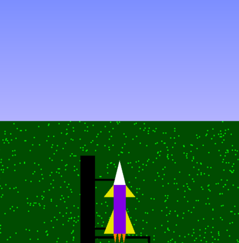
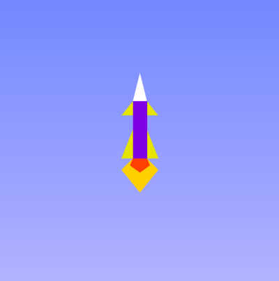
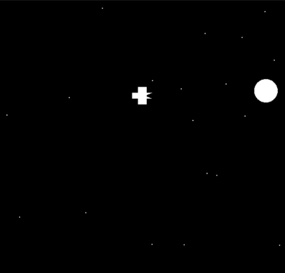
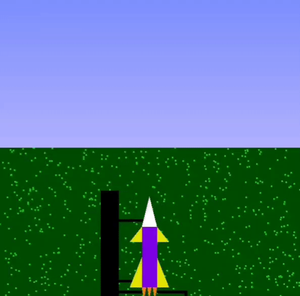

<h1 align="center">Rocket Launch Simulation</h1>
<div align="center">
  
  <h2> A 2D simulation of a rocket launch using computer graphics and visualization concepts in Opengl and python.</h2>
<h3>
  Names: Disha Shah and Hinal Pujara<br>
  Roll Nos.: 1911053 and 1911042<br>
  Course: CGV<br>
  Faculty: Vaibhav Vasani<br>
  College: KJ Somaiya college of engineering<br><br>
</h3>
</div>

<div align="center">

[](https://www.opengl.org/ "OpenGL")
[](https://www.python.org/ "Python")


</div>

<div>
<h4><b>Objective :</b></h4>

To show the simulation of rocket launch and illustrate the concept using opengl.
This project can be used for educational purposes or can also be incorporated into a game for leisure.


### <b>Snapshots of the project :</b>

<div align="center">
  






</div>  

### <b>Output of the project</b>

<div align="center">
  



</div>

### <b>To run this project :</b>

Clone the project -
```
  $ git clone https://github.com/dishaShah01/RocketLaunchSimulation.git
```
  
Install all the requirements -
```
 $ pip install PyOpenGL PyOpenGL_accelerate
```
Start the project, navigate to the project directory on the terminal;
 ### Run the script -
 for linux/mac :
```
  $ python Rocket_launch.py
```  
 for windows :
``` 
  $ python Rocket_launch.py
```

<h4>
<b>
Scope :
</b>
</h4>
<ul>
<li>The project provides a comprehensive simulation of how the rocket launch takes place on earth and the various stages the rocket goes through after the launch.</li>
<li>This is purely a 2D graphic animation.</li>
<li>Any type of controlling systems is not used in this project.</li>
</ul>
</div>

 #### <b>Features to be added :</b>
- Keyboard controls to make it dynamic.
- Create a 3D version. 

---

#### <div align="center">If you have any improvements create an issue and if you want you can also make a pull request for the same. </div>

---


---
<h3 align="center"><b>Developed by <a href="https://github.com/dishaShah01">Disha Shah</a> & <a href="https://github.com/hinalpujara">Hinal Pujara</a></b></h1>

