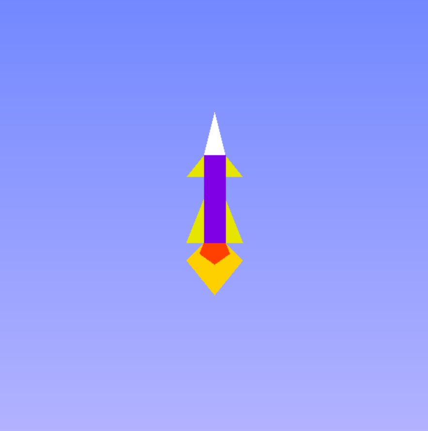
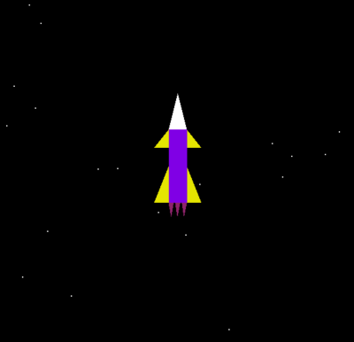
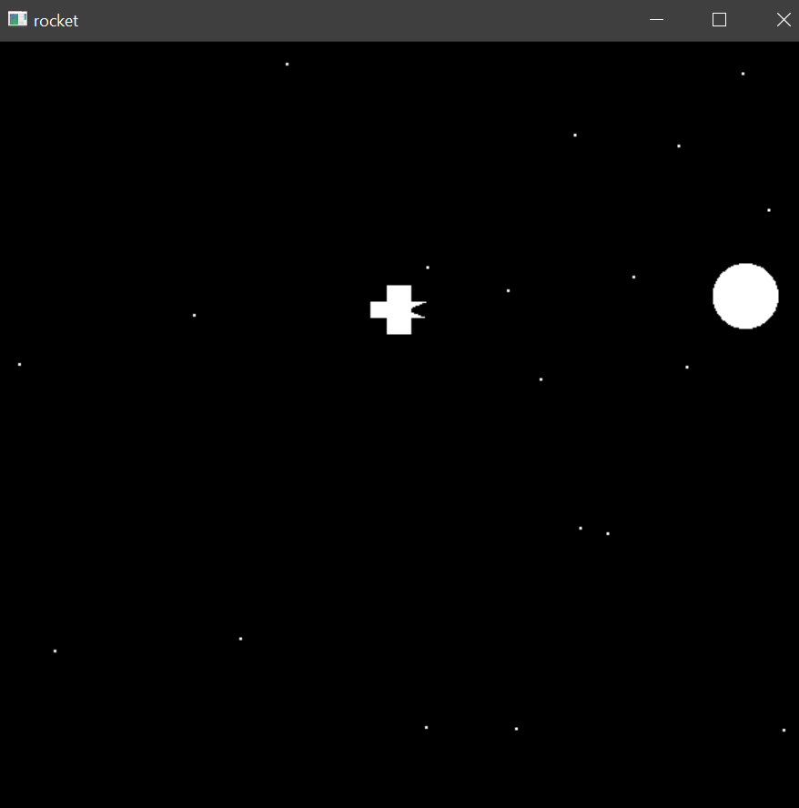
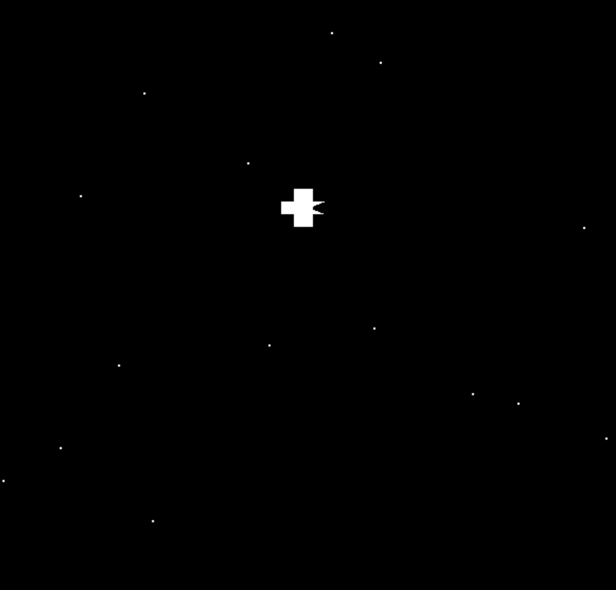

<h1 align="center">Rocket Launch Simulation</h1>
<div align="center">
  
  <h2> A 2D simulation of a rocket launch using computer graphics and visualization concepts in Opengl and python.</h2>
<h3>
  Names: Disha Shah and Hinal Pujara<br>
  Roll Nos.: 1911053 and 1911042<br>
  Course: CGV<br>
  Faculty: Vaibhav Vasani<br>
  College: KJ Somaiya college of engineering<br><br>
</h3>
</div>

<div align="center">

[](https://www.opengl.org/ "OpenGL")
[](https://www.python.org/ "Python")


</div>

<div>
<h4>
<b>Objective:</b></h4>

To show the simulation of rocket launch and illustrate the concept using opengl.

<br>


<h4>
<b>
Scope:
</b>
<h4>
<ul>
<li>
</li>
<li>
</li>
</ul>
</div>


### Snapshots of the project :

<div align="center">
  







</div>

### To run this project :

Clone the project -
```
  $ git clone https://github.com/dishaShah01/RocketLaunchSimulation.git
```
  
Install all the requirements -
```
 $ pip install PyOpenGL PyOpenGL_accelerate
```
Start the project, navigate to the project directory on the terminal;
 ### Run the script -
 for linux/mac :
```
  $ python Rocket_launch.py
```  
 for windows :
``` 
  $ python Rocket_launch.py
```

 #### Features to be added :
- Keyboard controls

---
- #### If you have any improvements create an issue and if you want you can also make a pull request for the same 

---


---
<h3 align="center"><b>Developed by <a href="https://github.com/dishaShah01">Disha Shah</a> & <a href="https://github.com/hinalpujara">Hinal Pujara</a></b></h1>

